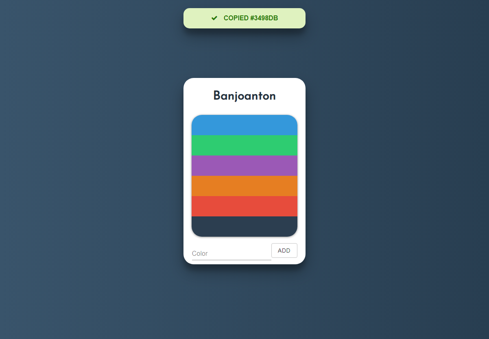

<p align="center">

  <a href="https://github.com/banjoanton/react-fullstack-template">
    
  </a>
  <h1 align="center">Color Saver</h1>

  <p align="center">
    Save your favorite colors temporary, easily accessable with a simple domain.
    <br />
  </p>
</p>



ColorSaver is a temporary color saver. Save your favorite colors on a unique domain that you can access from anywhere. Much like temporary email services.

## Table of Contents
- [Features](#heavy_check_mark-features)
- [Built with](#clipboard-built-with)
- [Installation](#cloud-installation)
- [Contributing](#wrench-contributing)

# :heavy_check_mark: Features

* **Save:** Save your favorite colors online
* **Access:** Access your domain and colors from anywhere
* **Copy:** Click to copy
* **Delete:** Right click to remove

# :clipboard: Built with
* **React.js**
* **Express**
* **Webpack**
* **MongoDB**

# :cloud: Download and run

```bash
# Clone repository
$ git clone https://github.com/banjoanton/color-saver.git

# Change directory to repository
$ cd "color-saver"

# Install node modules
$ npm install

# Run locally
$ npm run dev
```


# :wrench: Contributing
Pull requests are welcome.
